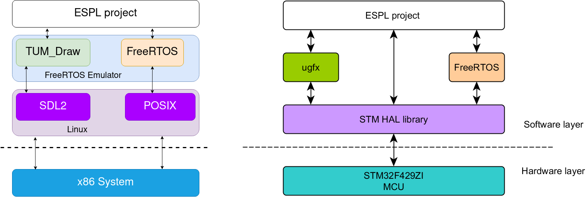

# Overview

My partner who names is Nino and I design this Flappy bird game, which is an application of POSIX based FreeRTOS with the combination of SDL2 graphics. 
We use the FReeRTOS Emulator of our tutor and deploy it on x86 System, this helps us get to know about FreeRTOS without the need of embedded hardware. We could also design it on STM32 board


  

## Dependencies

The FreeRTOS emulator uses SDL2 graphics libraries.

### Debian/Ubuntu

Assuming that you have some basic utilities like **make** **cmake**, **git** already installed, execute
> sudo apt-get install build-essential libsdl2-ttf-dev libsdl2-mixer-dev libsdl2-image-dev libsdl2-gfx-dev libsdl2-dev

Additional requirement for development
> sudo apt-get install clang-4.0 clang-tidy-4.0

### Arch
> sudo pacman -S sdl2 sdl2_gfx sdl2_image sdl2_mixer sdl2_ttf

Additional requirements for development
> sudo pacman -S clang

## Building

```
cd build
cmake ..
make
```
### Running

The binary will be created inside the bin folder. To run perform the following
```
cd bin
./FreeRTOS_Emulator
```
